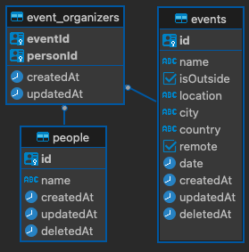
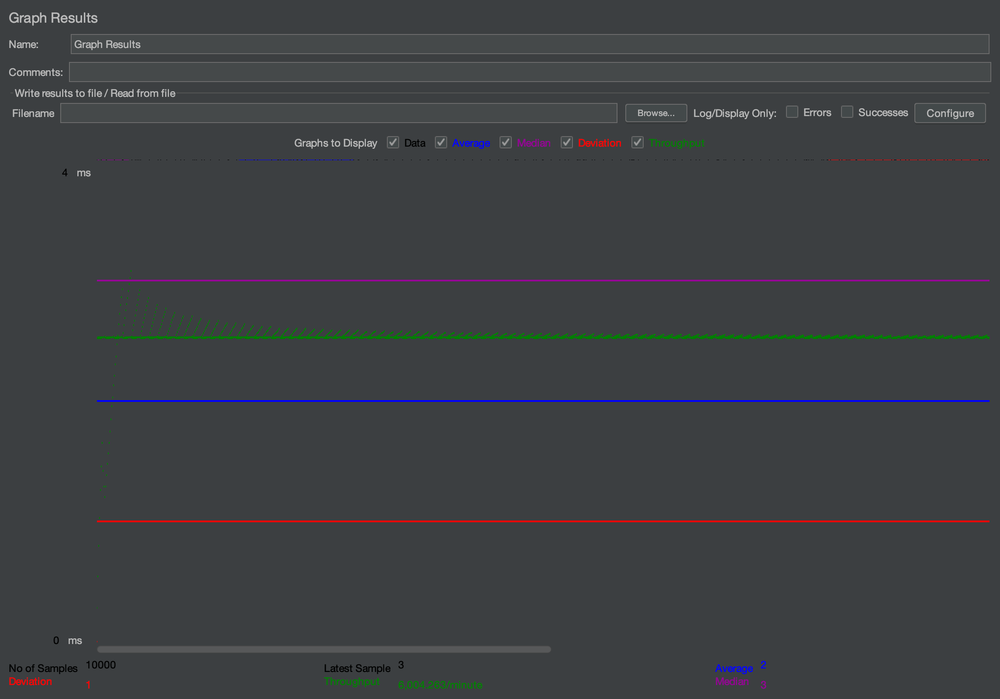
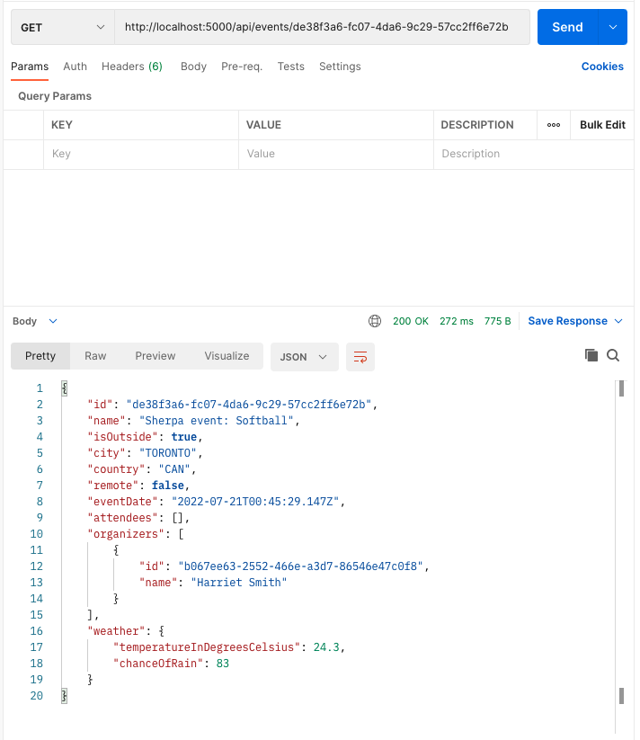
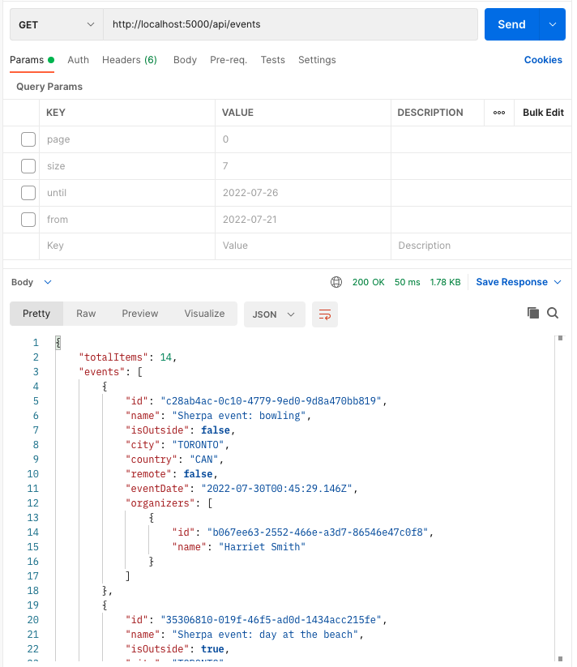
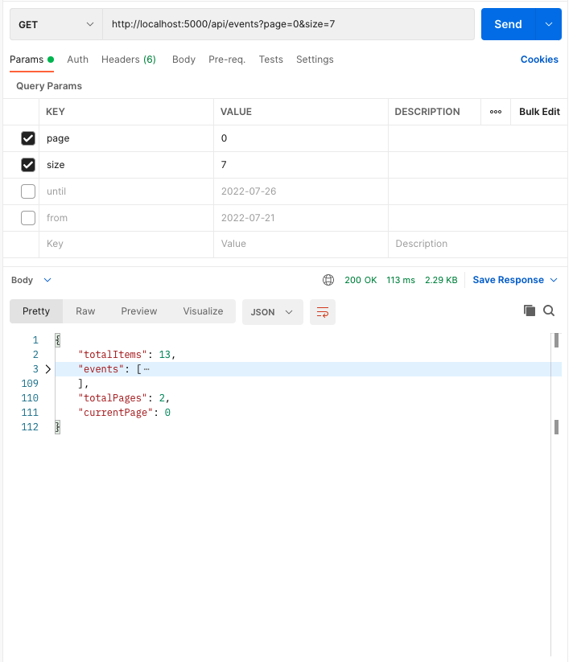

## Instructions on how to run the backend
- First install all the npm packages by running: `npm i` or `yarn`
- Spin up database and cache persistence: `npm run docker`
- Generate data by running: `npm run generateData` or `yarn generateData`
- Load the data into the database: `npm run importData` or `yarn importData`
- Run the server: `npm run build && npm run start` or `yarn build && yarn start`

---

## Implementation Details

### Database Schema

### ORM/DAO
I decided to go with PostgreSQL database instead of SQLite to demonstrate a more realistic use-case of having to host a very large dataset that can be scaled vertically. PostgreSQL closely adhere to SQL standards and has been ACID-compliant in order to achieve data integrity. It's also able to support complex query, which is not demonstrated in this repo but the idea is to be able to support in the future with more intricate functionality/services.

I used `sequelize` library to connect to the database as it provides type safety when creating entities and performing updates to the tables.

### Entities
This demo contains 3 main tables, `event`, `people` and `event_organizers` based on the objective. `event` table contains all the events that are being hosted by the organizers. `people` table hosts all the organizers and their information. event_organizers hosts the mapped Many-To-Many associations between `event` and `people`. The main indexes configured in the event table are `event_id`, `event_location`, `event_city`, `event_country`, `event_remote` and `event_date`. The main indexes configured in the people table are `person_id`.

`event_id` and `person_id` are the two indices to pay attention to in this demo as they are the most used.

### Cache
In order to speed the read operations and reduce the load as well as keeping the scalabity in mind, as most of the operations in the database will be reads by loading events, I decided to add a small redis layer. This cache layer is being utilized by an endpoint that fetches the event information in order to keep the users from querying the database with same information over and over again. It would be a good idea to cache the results of the weather service as well but it is not implemented due to the lack of time.

### Testing
Basic unit testing has been implemented to test utility methods, routes, and environment variables. There is a lot of room for improvement as testing goes, such as assing end-to-end testing to validate all the functional logic. A simple CI has been configured to run tests during each commit in order to ensure that any changes to the code is validated by test cases for consistenct behvaiour. 

### Validation
Basic validation for all the parameters have been implemented though I might be missing a few more validations due to time constaint. A standardize message can be improved upon as well as the response codes.

## Logger
A logger library called Winston is being utilized in this demo, which gives us the flexibility of logging it to console as well as to various transports such as Amazon CloudWatch, Amazon SNS, Google BigQuery, Graylog, Sentry, etc. This will provide us with a visibility during a production deployment. 

---
## Stress Test
A stress test was performed using JMeter to determine the type of load this backend can handle. The result seem to indicate that on average the backend is able to handle ~100 requests/sec based on the throughput value of ~6k/minute for `/api/events` endpoint. As for `/api/events/{eventId}` endpoint, the result is slightly lower with around ~99 requests/sec based on the throughput value of ~5967 requests/minute.

#### Stress Test for `/api/events`

#### Stress Test for `/api/events/{eventId}`

---

### Screenshots

